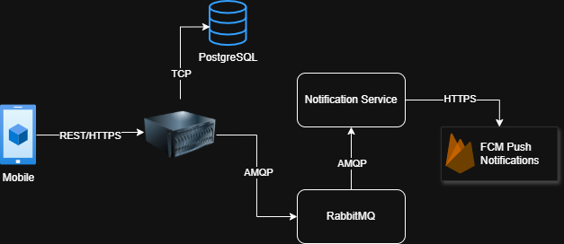

# Proposta de Domínio — Chef em Casa

**Disciplina:** Lab. de Desenvolvimento de Aplicações Móveis e Distribuídas  
**Aluno:** Ítalo Vitorino  
**Sprint:** 1 | **Prazo:** 11/05/2026

---

## 1. Descrição do Domínio

**Chef em Casa** é um marketplace para contratação de chefes de cozinha particulares. A plataforma conecta clientes que desejam um chef para eventos privados — jantares em casa, almoços, viagens e ocasiões especiais — com profissionais disponíveis para prestar o serviço.

O fluxo central começa quando o cliente escolhe um chef e envia um briefing detalhando o evento (tipo, data, número de convidados, endereço e duração estimada). O chef recebe a solicitação e responde com uma proposta comercial (valor, descrição do serviço e prazo de validade). A partir daí, cliente e chef negociam: o cliente pode aceitar, rejeitar ou solicitar uma revisão da proposta. Após o aceite, a reserva é confirmada e o serviço é agendado. Ao término, o cliente marca o serviço como concluído e o pagamento é processado. O ciclo se encerra com avaliação mútua entre cliente e chef.

---

## 2. Perfis de Usuário

| Perfil | Role no sistema | Responsabilidades |
|--------|-----------------|-------------------|
| **Cliente** | `CLIENT` | Envia briefing, negocia proposta (aceita, rejeita ou solicita revisão), confirma a reserva, encerra o serviço e realiza o pagamento |
| **Chef** | `CHEF` | Recebe solicitação, envia proposta de serviço, aguarda decisão do cliente e executa o serviço |

---

## 3. Principais Funcionalidades

### 3.1 Autenticação e Cadastro
- Registro de usuário (cliente ou chef) com nome, e-mail, senha e perfil
- Login com geração de JWT de acesso (TTL 15 min) e refresh token
- Renovação de token via refresh token

### 3.2 Gestão de Solicitações (fluxo principal)
- Cliente cria uma solicitação com briefing (tipo de evento, data, número de convidados, endereço, duração)
- Chef visualiza solicitações recebidas e envia proposta (valor, descrição, prazo de validade)
- Cliente pode: **aceitar**, **rejeitar** ou **solicitar revisão** da proposta
- Após aceite, reserva é confirmada; serviço pode ser concluído ou cancelado

### 3.3 Pagamento (simulado)
- Ao aceitar a proposta, o sistema inicia o fluxo de pagamento simulado
- Eventos `pagamento.iniciado` e `pagamento.confirmado` são publicados no broker
- Não há integração com gateway externo nesta fase — o pagamento é aprovado automaticamente para fins de demonstração

### 3.4 Máquina de Estados da Solicitação

```
AWAITING_PROPOSAL
      │
      ▼  (chef envia proposta)
PROPOSAL_SENT ──────────────────────────────────────┐
      │                                              │
      ├─ aceita ──► RESERVATION_CONFIRMED            │
      ├─ rejeita ──► CANCELLED                       │
      └─ revisão ──► AWAITING_PROPOSAL ──────────────┘

RESERVATION_CONFIRMED
      ├─ conclui ──► SERVICE_COMPLETED
      └─ cancela ──► CANCELLED
```

### 3.5 Tipos de Evento Suportados
`PRIVATE_DINNER`, `LUNCH`, `CORPORATE_EVENT`, `TRAVEL`, `OTHER`

---

## 4. Arquitetura do Sistema



**Protocolos de comunicação:**
- Mobile ↔ Backend: **REST/HTTPS** (JSON)
- Backend → RabbitMQ: **AMQP** (mensagens persistentes, `delivery_mode=2`)
- RabbitMQ → Notification Service: **AMQP** (filas com DLQ)
- Notificações push: **FCM** via Firebase HTTPS/Admin SDK

---

## 5. Schema do Banco de Dados

O banco é PostgreSQL com schemas separados por bounded context.

### Schema `identity`

```sql
CREATE TABLE identity.users (
    id            UUID         PRIMARY KEY,
    email         VARCHAR(255) NOT NULL UNIQUE,
    password_hash VARCHAR(255) NOT NULL,
    name          VARCHAR(255) NOT NULL,
    role          VARCHAR(20)  NOT NULL,   -- CLIENT | CHEF
    active        BOOLEAN      NOT NULL DEFAULT TRUE,
    created_at    TIMESTAMPTZ  NOT NULL
);

CREATE TABLE identity.refresh_tokens (
    id         UUID        PRIMARY KEY,
    user_id    UUID        NOT NULL REFERENCES identity.users(id),
    token      UUID        NOT NULL UNIQUE,
    expires_at TIMESTAMPTZ NOT NULL,
    revoked    BOOLEAN     NOT NULL DEFAULT FALSE,
    created_at TIMESTAMPTZ NOT NULL
);
```

### Schema `solicitations`

```sql
CREATE TABLE solicitations.solicitations (
    id                         UUID         PRIMARY KEY,
    client_id                  UUID         NOT NULL,
    chef_id                    UUID         NOT NULL,
    status                     VARCHAR(50)  NOT NULL,
    -- briefing (embutido no aggregate root)
    event_type                 VARCHAR(50)  NOT NULL,
    event_date                 DATE         NOT NULL,
    number_of_guests           INT          NOT NULL,
    street                     VARCHAR(255) NOT NULL,
    number                     VARCHAR(20)  NOT NULL,
    city                       VARCHAR(100) NOT NULL,
    state                      VARCHAR(100) NOT NULL,
    zip_code                   VARCHAR(20)  NOT NULL,
    estimated_duration_minutes INT          NOT NULL,
    notes                      TEXT,
    created_at                 TIMESTAMPTZ  NOT NULL,
    updated_at                 TIMESTAMPTZ  NOT NULL
);

CREATE TABLE solicitations.proposals (
    id                  UUID           PRIMARY KEY,
    solicitation_id     UUID           NOT NULL REFERENCES solicitations.solicitations(id),
    total_amount        NUMERIC(10, 2) NOT NULL,
    service_description TEXT           NOT NULL,
    valid_until         DATE           NOT NULL,
    notes               TEXT,
    sent_at             TIMESTAMPTZ    NOT NULL,
    is_current          BOOLEAN        NOT NULL DEFAULT false
);

CREATE INDEX idx_solicitations_client_id ON solicitations.solicitations(client_id);
CREATE INDEX idx_solicitations_chef_id   ON solicitations.solicitations(chef_id);
CREATE INDEX idx_proposals_solicitation  ON solicitations.proposals(solicitation_id);
```

**Decisões de schema:**
- Briefing desnormalizado em `solicitations` (faz parte do mesmo aggregate root)
- `proposals` mantém histórico completo; `is_current = true` identifica a proposta ativa
- Schemas separados (`identity`, `solicitations`) refletem a fronteira dos bounded contexts
- Migrações gerenciadas por **Flyway** (`V1`–`V4`)

---

## 6. Topologia de Eventos (RabbitMQ)

Exchange: `chefemcasa.events` (topic, durable). Fila `notificacoes.queue` com bind em `#` consome todos os eventos e decide quais viram push notification.

| Routing key | Produzido quando |
|-------------|-----------------|
| `identidade.usuario.registrado` | Novo usuário se cadastra |
| `solicitacoes.briefing.submetido` | Cliente cria solicitação |
| `solicitacoes.proposta.enviada` | Chef envia proposta |
| `solicitacoes.proposta.aceita` | Cliente aceita proposta |
| `solicitacoes.proposta.recusada` | Cliente rejeita proposta |
| `solicitacoes.proposta.revisada` | Cliente solicita revisão |
| `solicitacoes.reserva.cancelada` | Solicitação cancelada |
| `solicitacoes.servico.concluido` | Serviço marcado como concluído |
| `pagamento.iniciado` | Reserva confirmada (aceite da proposta) |
| `pagamento.confirmado` | Pagamento simulado aprovado |
